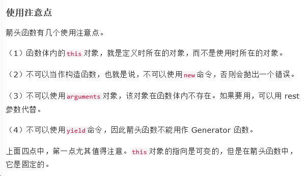

# 基本用法
ES6 允许使用“箭头”（=>）定义函数。
```
var f = v => v;

// 等同于
var f = function (v) {
  return v;
};
```

如果箭头函数不需要参数或需要多个参数，就使用一个圆括号代表参数部分。
```
var f = () => 5;
// 等同于
var f = function () { return 5 };

var sum = (num1, num2) => num1 + num2;
// 等同于
var sum = function(num1, num2) {
  return num1 + num2;
};
```

如果箭头函数的代码块部分多于一条语句，就要使用大括号将它们括起来，并且使用return语句返回。
```
var sum = (num1, num2) => { return num1 + num2; }
```

由于大括号被解释为代码块，所以如果箭头函数直接返回一个对象，必须在对象外面加上括号，否则会报错。
```
// 报错
let getTempItem = id => { id: id, name: "Temp" };

// 不报错
let getTempItem = id => ({ id: id, name: "Temp" });

//下面是一种特殊情况，虽然可以运行，但会得到错误的结果。
let foo = () => { a: 1 };
foo() // undefined
```

上面代码中，原始意图是返回一个对象{ a: 1 }，但是由于引擎认为大括号是代码块，所以执行了一行语句a: 1。这时，a可以被解释为语句的标签，因此实际执行的语句是1;，然后函数就结束了，没有返回值。
如果箭头函数只有一行语句，且不需要返回值，可以采用下面的写法，就不用写大括号了。
let fn = () => void doesNotReturn();

箭头函数可以与变量解构结合使用。
```
const full = ({ first, last }) => first + ' ' + last;

// 等同于
function full(person) {
  return person.first + ' ' + person.last;
}
```

箭头函数使得表达更加简洁。
const isEven = n => n % 2 == 0;
const square = n => n * n;

上面代码只用了两行，就定义了两个简单的工具函数。如果不用箭头函数，可能就要占用多行，而且还不如现在这样写醒目。
箭头函数的一个用处是简化回调函数。
// 正常函数写法
```
[1,2,3].map(function (x) {
  return x * x;
});
```

// 箭头函数写法
```
[1,2,3].map(x => x * x);
```

另一个例子是
// 正常函数写法
```
var result = values.sort(function (a, b) {
  return a - b;
});
```

// 箭头函数写法
```
var result = values.sort((a, b) => a - b);
```

下面是 rest 参数与箭头函数结合的例子。
```
const numbers = (...nums) => nums;

numbers(1, 2, 3, 4, 5)
// [1,2,3,4,5]

const headAndTail = (head, ...tail) => [head, tail];

headAndTail(1, 2, 3, 4, 5)
// [1,[2,3,4,5]]
```

